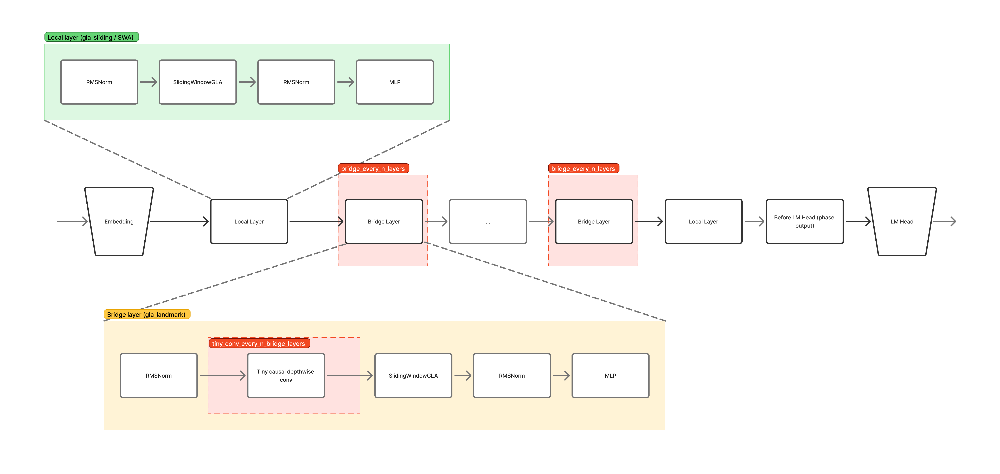

# Budgie

Budgie is a small research codebase for a decoder-only language model that experiments with:

- **GLA-style latent attention** (`gla_sliding`, `gla_landmark`) implemented on top of PyTorch **SDPA** (no Hopper-only FlashAttention requirement).
- A **hybrid layer schedule**: sliding-window “local” layers + landmark “bridge” layers.
- Optional **tiny causal depthwise conv** in selected layers.
- Optional **multi-phase stack reuse** (`num_phases > 1`): run the whole decoder stack multiple times, feeding the last-layer output back into layer 0 (Universal-Transformer-style), with optional **per-(phase,layer) gates**.
- Optional **ALBERT-style depth sharing** (`share_all_layers=True`): share one attention+MLP core across all layers (still compatible with hybrid algorithms).

This repo is intended for experimentation and smoke-testing, not as a polished training framework.

## Architecture

## Layout

- `budgie/budgie_config.py` – `BudgieConfig` (Transformers `PretrainedConfig`)
- `budgie/budgie_model.py` – `BudgieModel`
- `budgie/budgie_for_causal_lm.py` – `BudgieForCausalLM`
- `budgie/modeling_budgie_GLA.py` – attention + conv implementations

## Install / Run

This repo is intentionally minimal (no packaging). 

Dependencies:
- Python 3.10+ recommended
- `torch`
- `transformers`
- Optional: `xformers` (may accelerate some attention shapes; sliding-window local attention is not guaranteed on older GPUs)
- Optional: `flash attention` (may accelerate some attention shapes; sliding-window local attention is not guaranteed on older GPUs)
- Optional: `causal_conv1d` (if you enable `use_causal_conv1d=True`)

## Key config knobs

### Attention implementations

- `config._attn_implementation="sdpa"`: base attention backend uses PyTorch SDPA where applicable.
- `local_attn_implementation="gla_sliding"`: local layers use sliding-window attention (`sliding_window` required).
- `bridge_attn_implementation="gla_landmark"`: bridge layers use landmark attention.

### Hybrid layer schedule

Enable with:
- `use_hybrid_layers=True`
- `bridge_every_n_layers` and `bridge_layer_offset`

Bridge layers are at indices:
`bridge_layer_offset + k * bridge_every_n_layers`

### Sliding window

- `sliding_window`: int window size for local layers (canonical name; legacy `attention_window` is mapped to it on load).

### Landmark attention

Two ways to define landmarks:

- **Positional**: `landmark_every=N` (landmarks assumed at `N-1, 2N-1, ...`)
- **Token-id**: `landmark_token_id=<id>` (landmarks are `input_ids == landmark_token_id`)

### Tiny conv

- `use_tiny_conv=True`
- `use_causal_conv1d=True` to use `causal_conv1d` when available
- Under hybrid mode you can choose where conv is enabled:
  - `tiny_conv_on_local_layers`
  - `tiny_conv_on_bridge_layers`
  - `tiny_conv_every_n_bridge_layers`, `tiny_conv_bridge_start`

### Multi-phase stack reuse

- `num_phases > 1` re-runs the full decoder stack multiple times.
- KV-cache is supported when `num_phases > 1` using dynamic cache (`transformers.cache_utils.DynamicCache`).
  - Cache memory scales roughly with `num_phases`.
  - Static cache modes (e.g. `StaticCache`) are not supported for `num_phases > 1` yet.

Optional conditioning:
- `use_phase_layer_gates=True` enables per-(phase,layer) gates that scale attention and MLP residual updates.

### ALBERT-style depth sharing (optional)

- `share_all_layers=True` shares **one attention+MLP core** across all layers.
- LayerNorms (and optional conv scaffolds) remain per-layer.

### GLA grouping

- `gla_num_groups` controls how many **latent groups** are used inside Budgie’s `LlamaGLA` implementation.
  - Default is `2` (historical behavior).
  - Must divide `num_attention_heads`.
  - In this implementation, increasing groups increases the compressed KV projection size (more parameters/compute).

### Liger kernels (optional)

With `use_liger_kernel=True` and `liger_kernel` installed, Budgie will opportunistically use Liger kernels when
available:

- `LigerRMSNorm` + `LigerSwiGLUMLP` (existing)
- `experimental.LigerEmbedding` (when available)
- `liger_rotary_pos_emb` (when available)
- `LigerSoftmax` in eager attention paths (when available)
- `LigerFusedLinearCrossEntropyLoss` for training loss (otherwise `LigerCrossEntropyLoss`, otherwise PyTorch CE)

If a kernel can’t be imported or fails at runtime, Budgie falls back to the PyTorch implementation.

Notes:
- `LigerEmbedding` is experimental.
- When fused linear+CE is used during training, logits are still returned but computed under `torch.no_grad()` to
  reduce VRAM.

## Notes for older GPUs (e.g., V100 / sm70)

- Budgie uses SDPA/eager attention paths; Hopper-only FlashAttention is not required.
- xFormers may still be useful for some dense attention shapes, but **sliding-window local attention via xFormers is not guaranteed** on all GPUs/dtypes/head dimensions. Budgie includes fallbacks.

## License

MIT (see `LICENSE`).
